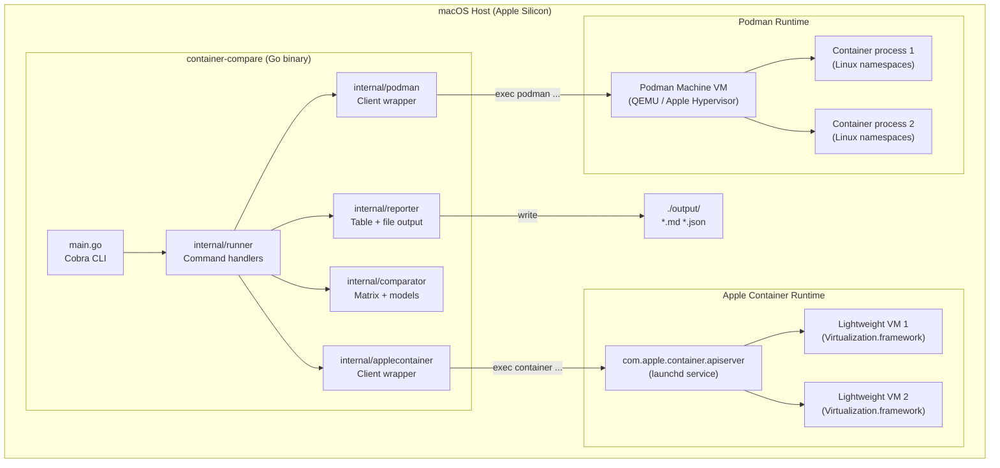
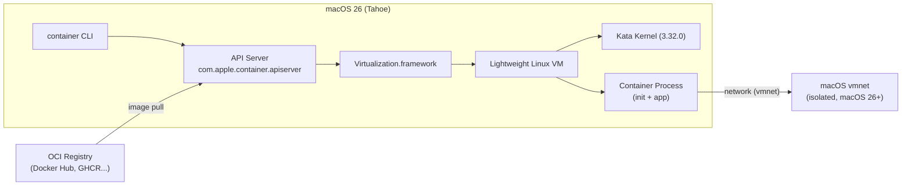
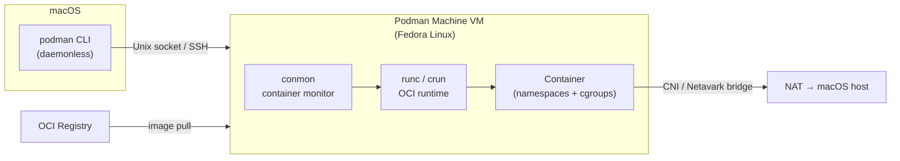
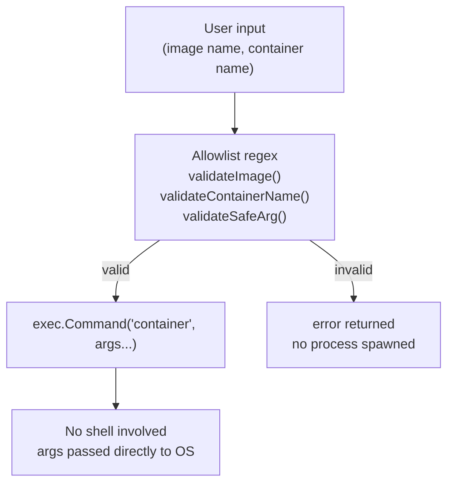
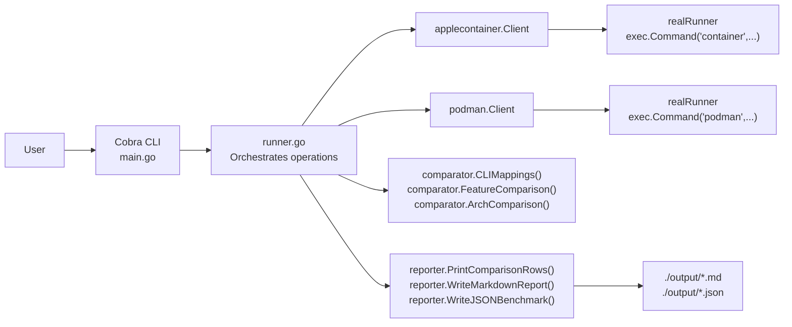

# Architecture

This document describes the technical architecture of `container-compare` and the two runtimes it exercises.

---

## System Architecture

---

## Apple Container Architecture

### Key concepts

- **API Server** (`com.apple.container.apiserver`): The launchd background service that manages the container lifecycle. Start with `container system start`, stop with `container system stop`.
- **Lightweight VM**: Each container gets its own isolated VM via `Virtualization.framework`. This provides stronger isolation than namespace-based containers at the cost of slightly higher startup time.
- **Kata Kernel**: Apple Container uses a Kata Containers kernel as the guest OS kernel inside each VM. The default is `3.32.0-debug` as of v1.3.0.
- **vmnet networking**: On macOS 26+, each VM gets its own virtual NIC with a unique IP. The IP is visible in `container list` output.
- **Rosetta 2**: The `--rosetta` flag enables Apple's binary translation layer inside the VM, allowing x86_64 images to run natively on Apple Silicon.

---

## Podman Architecture (macOS)

### Key concepts

- **Daemonless**: Every `podman` invocation is a self-contained process. There is no persistent Podman daemon on macOS.
- **Podman Machine**: On macOS, Podman runs containers inside a Linux VM (Podman Machine). The VM is shared among all containers.
- **conmon**: A lightweight container monitor process that maintains the container state and pipes I/O.
- **crun / runc**: The OCI runtime that creates Linux namespaces and cgroups for isolation.
- **Netavark / CNI**: Podman uses either CNI or Netavark for container networking inside the Linux VM.

---

## Security Model

Both runtimes validate all input before constructing exec.Command calls:

---

## Data Flow

