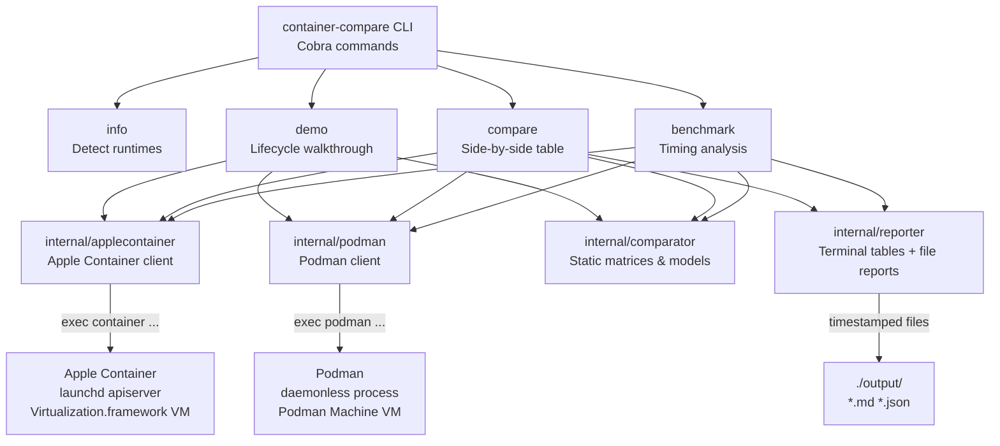
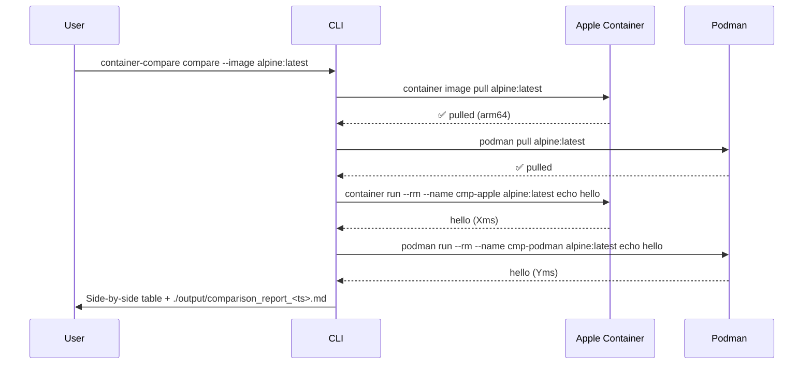

# container-compare

> An educational Go application that demonstrates and compares container operations between **Apple Container v1.3.1** and **Podman** on macOS.

[](LICENSE)
[](https://go.dev)
[](https://apple.com)

---

## Overview

`container-compare` is a didactical CLI tool that runs side-by-side container operations on both **Apple Container** and **Podman**, prints annotated output, and writes timestamped comparison reports. It is designed to help engineers understand:

- How each runtime achieves container isolation on macOS
- Command-level differences and equivalences
- Performance characteristics (startup, pull, run timing)
- JSON output format differences

### Runtimes Compared

| Runtime | Version | Technology |
|---------|---------|-----------|
| [Apple Container](https://github.com/apple/container) | v1.3.1 | Lightweight VM per container (Virtualization.framework) |
| [Podman](https://podman.io) | v5.x | Daemonless; Linux namespaces inside Podman Machine VM |

---

## Architecture



---

## Workflow



---

## Project Structure

```
.
├── main.go                          # Entry point + Cobra command tree
├── go.mod                           # Go module definition
├── go.sum                           # Dependency checksums
├── Containerfile                    # OCI build for the tool itself
├── .env.example                     # Environment variable template
├── .gitignore
├── internal/
│   ├── applecontainer/
│   │   ├── client.go                # Apple Container CLI wrapper
│   │   └── client_test.go           # Unit tests (fake runner)
│   ├── podman/
│   │   ├── client.go                # Podman CLI wrapper
│   │   └── client_test.go           # Unit tests (fake runner)
│   ├── comparator/
│   │   ├── matrix.go                # Static comparison tables + data models
│   │   └── matrix_test.go           # Unit tests
│   ├── reporter/
│   │   └── reporter.go              # Terminal tables + Markdown/JSON writers
│   └── runner/
│       └── runner.go                # Top-level command implementations
├── Docs/
│   ├── Quickstart.md
│   ├── Architecture.md
│   └── Comparison.md
├── scripts/
│   ├── start.sh                     # Build + run in background
│   ├── stop.sh                      # Graceful shutdown
│   ├── cleanup.sh                   # Remove build artefacts
│   └── delete-images.sh             # Remove pulled container images
├── input/                           # Reserved for input documents
├── output/                          # Timestamped reports (git-ignored content)
└── .bob/
    └── artifacts/                   # Project artifact summary
```

---

## Prerequisites

| Tool | Version | Purpose |
|------|---------|---------|
| Go | 1.22+ | Build the tool |
| Apple Container | v1.3.1 | One of the runtimes under test |
| Podman | v5.x+ | Other runtime under test |

Install Apple Container:
```bash
# Download signed installer from GitHub releases
open https://github.com/apple/container/releases/tag/1.3.1
```

Install Podman:
```bash
brew install podman
podman machine init && podman machine start
```

---

## Quick Start

```bash
# 1 – Clone and build
git clone https://github.com/your-org/apple-container-update
cd apple-container-update
go build -o container-compare .

# 2 – Detect installed runtimes
./container-compare info

# 3 – Run the full lifecycle demo
./container-compare demo

# 4 – Side-by-side comparison table
./container-compare compare

# 5 – Benchmark (3 iterations)
./container-compare benchmark --iterations 3
```

Or use the provided scripts:

```bash
# First make scripts executable (one-time)
chmod +x scripts/start.sh scripts/stop.sh scripts/cleanup.sh scripts/delete-images.sh

./scripts/start.sh     # build + run info command
./scripts/stop.sh      # graceful stop
./scripts/cleanup.sh   # remove build artefacts
```

---

## Commands

```
container-compare [command] [flags]

Commands:
  info        Detect and display installed runtime versions
  demo        Run educational container lifecycle demos
  compare     Side-by-side comparison of operations on both runtimes
  benchmark   Benchmark identical operations across both runtimes
  help        Help about any command

Flags:
  -h, --help   help for container-compare
```

### `info`
Detects both runtimes, prints versions, and displays the static architecture comparison table.

### `demo`
```
Flags:
  -i, --image string     OCI image for the demo (default "alpine:latest")
  -r, --runtime string   "apple", "podman", or "both" (default "both")
```

### `compare`
```
Flags:
  -i, --image string   OCI image for comparison (default "alpine:latest")
```
Writes a Markdown report to `./output/comparison_report_<timestamp>.md`.

### `benchmark`
```
Flags:
  -i, --image string      OCI image to benchmark (default "alpine:latest")
  -n, --iterations int    Iterations per operation (1–10, default 3)
```
Writes JSON results to `./output/benchmark_<timestamp>.json`.

---

## Configuration

Copy `.env.example` to `.env` and adjust if needed:

```bash
cp .env.example .env
```

No secrets are required for the default `alpine:latest` demo. For private registries:

```
REGISTRY_USERNAME=your_username
REGISTRY_PASSWORD=your_password   # or use `container registry login`
```

---

## Output Files

All reports are written to `./output/` with ISO-8601 timestamps:

| File pattern | Format | Description |
|---|---|---|
| `comparison_report_<ts>.md` | Markdown | Full comparison matrix + live results |
| `benchmark_<ts>.json` | JSON | Raw timing data for all operations |

---

## Running Tests

```bash
go test ./...

# With coverage report
go test -cover ./...

# Run only a specific package
go test ./internal/comparator/...
```

---

## Building a Container Image of This Tool

```bash
podman build -t container-compare:latest .
# or using Apple Container:
container build -t container-compare:latest .
```

---

## Key Differences at a Glance

| Aspect | Apple Container | Podman |
|--------|----------------|--------|
| Isolation | VM per container | Namespaces + cgroups |
| Daemon | API server (launchd) | Daemonless |
| macOS 26 required | For full networking | No |
| Rosetta 2 | `--rosetta` flag | Not supported natively |
| IP per container | Always (VM NIC) | Via bridge (inspect needed) |
| `list` vs `ps` | `container list` | `podman ps` |
| Delete image | `container image delete` | `podman rmi` |

See [Docs/Comparison.md](Docs/Comparison.md) for the full matrix.

---

## Licence

This project is licensed under the **Apache License 2.0**.  
See [LICENSE](LICENSE) for details.

Apple Container is © Apple Inc., Apache License 2.0.  
Podman is © Red Hat Inc., Apache License 2.0.
