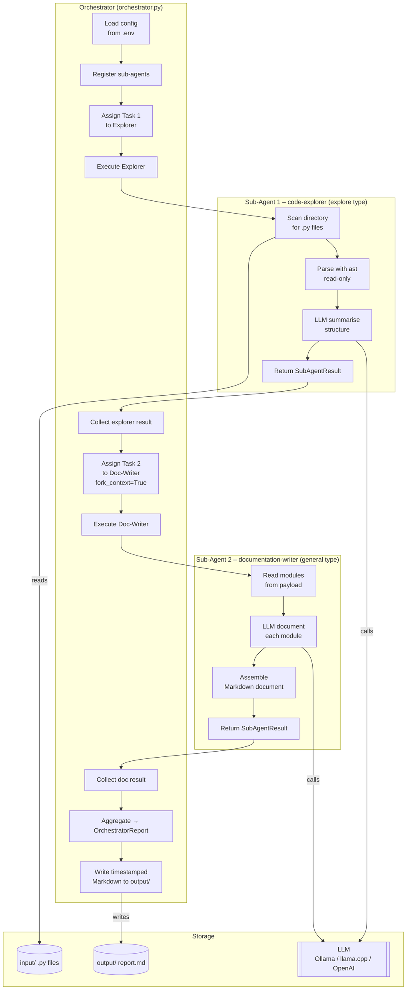
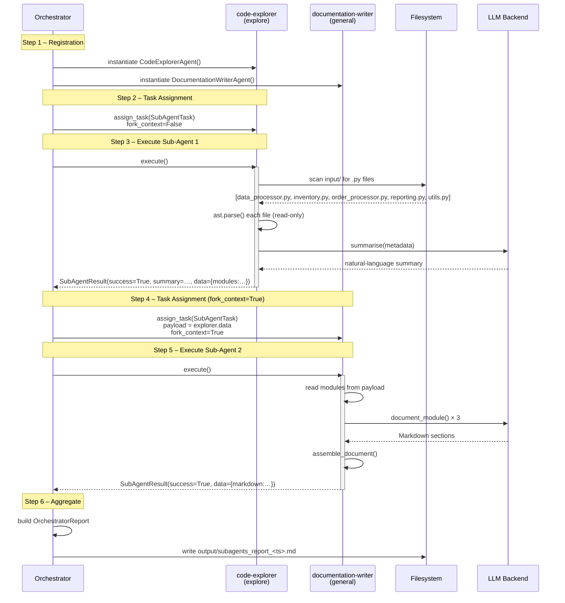
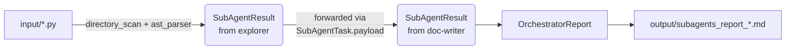

# Architecture

> Sub-Agents Demo – system structure and execution flow

---

## Component Overview

The application consists of five Python modules, three agent roles, and a Streamlit web UI.

```
subagents-demo/src/
├── models.py                     # DTOs shared across all agents
├── utils.py                      # LLM factory, logging, output helpers
├── code_explorer_agent.py        # Sub-Agent 1: explore type
├── documentation_writer_agent.py # Sub-Agent 2: general type
├── orchestrator.py               # Parent / orchestrator agent
└── ui.py                         # Streamlit web UI (6-tab browser interface)
```

---

## High-Level Architecture



---

## Sub-Agent Lifecycle (per Bob documentation)



---

## Data Flow



---

## Key Design Decisions

| Decision | Rationale |
|---|---|
| Agents are plain Python classes, not threads | Keeps the demo simple and portable; the key concepts (isolation, delegation, result-return) are fully demonstrated regardless of concurrency model |
| Explorer runs first, writer second (sequential) | The writer explicitly depends on the explorer's output – this demonstrates the `fork_context` pattern cleanly |
| LLM abstracted behind a callable | Allows switching between Ollama (default, no API key), llama.cpp (fully offline GGUF), and OpenAI with a single `LLM_BACKEND` env-var change |
| `SubAgentTask.fork_context` flag | Mirrors the exact `fork_context` parameter described in the Bob documentation |
| `requests` library for HTTP | Avoids `urllib` dynamic URL risks flagged by static analysis |
